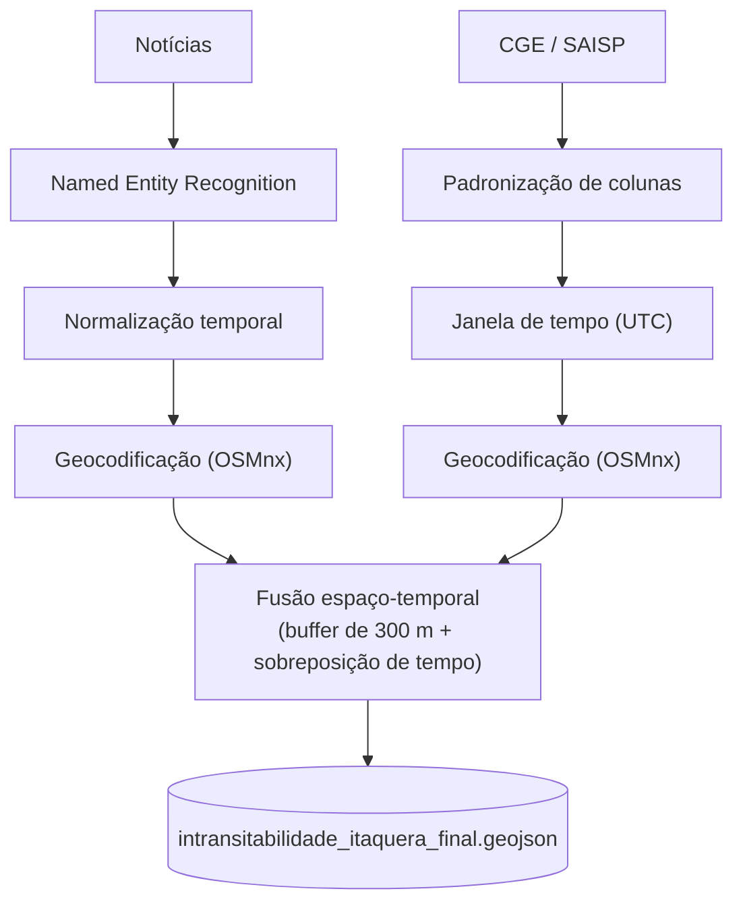

<div align="center">

# Flood Fusion SP

**Fusão espaço-temporal de notícias e registros da Defesa Civil para mapear a intransitabilidade viária causada por chuvas severas.**

[](https://www.python.org/)
[](https://geopandas.org/)
[](https://osmnx.readthedocs.io/)
[](https://docs.pydantic.dev/)

</div>

---

## Visão geral

O **Flood Fusion SP** é um pipeline de dados que une duas fontes de naturezas diferentes:

- **Texto não estruturado**: notícias (G1 e boletins oficiais);
- **Registros institucionais abertos**: pontos de alagamento do CGE/PMSP, publicados nos boletins do SAISP.

A partir delas, o sistema converte menções em linguagem natural ("das 16h34 às 17h05", "na Rua Cunha Porã") e registros tabulares em **geometrias georreferenciadas com janela de tempo**, e cruza as duas fontes para produzir um GeoJSON das vias que ficaram intransitáveis durante eventos de chuva severa.

> **Escopo de validação:** distrito de **Itaquera** (São Paulo), eventos de **17 e 18/01/2024**.

## Resultado atual

Sobre esse recorte, o pipeline gerou **5 ocorrências** (geometrias `MultiLineString`, seguindo o traçado das vias no OpenStreetMap):

| `status_fusao` | Ocorrências | `confianca_geral` |
|---|---|---|
| `CONFIRMADO_DUPLO` | 1 | 1.0 |
| `APENAS_CGE` | 4 | 0.85 |
| `APENAS_MIDIA` | 0 | – |

| Via | Janela (horário de Brasília) | Status |
|---|---|---|
| Rua Cunha Porã | 17/01/2024, 16:18 – 17:05 | `CONFIRMADO_DUPLO` |
| R. Itagimirim | 17/01/2024, 16:23 – 17:15 | `APENAS_CGE` |
| Av. Itaquera | 17/01/2024, 16:25 – 16:56 | `APENAS_CGE` |
| Av. Miguel Ignácio Curi | 17/01/2024, 16:47 – 17:06 | `APENAS_CGE` |
| Av. Jacu-Pêssego / N. Trabalhadores | 17/01/2024, 17:33 – 17:37 | `APENAS_CGE` |

**Como ler esse resultado:** a única confirmação dupla liga uma menção da Rua Cunha Porã a um registro do CGE na Av. Itaquera, por proximidade (buffer de 300 m) e sobreposição de horário. Veja as ressalvas em [Limitações](#limitações).

## Funcionalidades

| Componente | O que faz |
|---|---|
| **Ingestão** | Coleta de notícias e dos boletins do SAISP, com modelos de dados validados por **Pydantic V2**. |
| **Reconhecimento de entidades (NER)** | Extrai logradouros e pontos de referência do texto com spaCy (`pt_core_news_sm`) combinado a regras de endereço. |
| **Normalização temporal** | Resolve menções como "ontem às 18h" ou "das 16h34 às 17h05" em intervalos ISO 8601 (fuso de São Paulo), ancorados na data de publicação. Períodos do dia sem hora exata ("fim da tarde") são marcados como estimados. |
| **Geocodificação** | Extrai a malha viária do OpenStreetMap via **OSMnx**, normaliza nomes de logradouros e usa *fuzzy matching*; se a via não é encontrada, cai para o centroide da área com confiança baixa. |
| **Fusão espaço-temporal** | Projeta tudo em **SIRGAS 2000 / UTM 23S (EPSG:31983)** e casa notícia e registro quando há **sobreposição de janelas de tempo** e a geometria da notícia, com buffer de **300 m**, intersecta a do CGE. |
| **Produto final** | GeoJSON com status de validação cruzada e confiança por ocorrência. |

## Arquitetura



## Dicionário de dados

Produto final: `data/processed/intransitabilidade_itaquera_final.geojson`.

| Campo | Tipo | Descrição | Exemplo |
|---|---|---|---|
| `logradouro` | `string` | Via identificada. Registros do CGE mantêm a grafia do boletim (abreviada, em maiúsculas). | `"Rua Cunha Porã"`, `"AV ITAQUERA"` |
| `inicio_evento` | `string` | Início da obstrução, em ISO 8601 com fuso explícito. | `"2024-01-17T19:18:00+00:00"` |
| `fim_evento` | `string` | Fim da obstrução, mesmo formato. | `"2024-01-17T20:05:00+00:00"` |
| `status_fusao` | `string` | Validação cruzada. | `CONFIRMADO_DUPLO`, `APENAS_CGE`, `APENAS_MIDIA` |
| `fontes` | `string` | Fontes que sustentam a ocorrência. | `"G1+CGE"`, `"CGE"`, `"G1"` |
| `confianca_geral` | `float` | Confiança atribuída à ocorrência, em `[0.0, 1.0]`. Ver regra abaixo. | `1.0`, `0.85` |
| `geometry` | `Geometry` | Geometria em WGS 84 (EPSG:4326); neste recorte, `MultiLineString`. | – |

**Regra da confiança (heurística fixa, não calibrada):** `1.0` para dupla confirmação; `0.85` para registros do CGE sem confirmação; para ocorrências só de mídia, vale a confiança da geocodificação (`1.0` se a via foi encontrada, menor se houve similaridade parcial ou fallback para o centroide).

## Estrutura do repositório

```text
flood-fusion-sp/
├── data/
│   ├── raw/                  # Notícias brutas (JSON Lines)
│   └── processed/            # Registros padronizados, malha OSM e GeoJSONs
├── src/
│   ├── cge/                  # Download e extração dos boletins do SAISP
│   ├── scraper/              # Modelos Pydantic e coleta de notícias
│   ├── ner/                  # Extração de entidades nomeadas
│   ├── temporal/             # Ancoragem relativa e conversão para ISO 8601
│   └── spatial/              # Geocodificação, correspondência difusa e fusão
├── tests/                    # Testes (pytest)
├── main.py                   # Orquestrador da esteira
└── requirements.txt
```

## Instalação e execução

### Pré-requisitos

- Python **3.10** ou superior
- Em alguns sistemas, as bibliotecas **GDAL** e **GEOS** precisam estar instaladas

### Ambiente

**Windows (PowerShell)**

```powershell
python -m venv .venv
.\.venv\Scripts\Activate.ps1
pip install -r requirements.txt
python -m spacy download pt_core_news_sm
```

**Linux / macOS**

```bash
python -m venv .venv
source .venv/bin/activate
pip install -r requirements.txt
python -m spacy download pt_core_news_sm
```

### Pipeline

Pelo orquestrador:

```bash
python main.py
```

Ou etapa por etapa:

```bash
python -m src.cge.download         # registros do CGE (boletins SAISP)
python -m src.ner.annotate         # entidades nas notícias
python -m src.temporal.normalize   # janelas de tempo
python -m src.spatial.geocode      # geometrias das notícias
python -m src.spatial.fusion       # fusão e GeoJSON final
```

### Testes

```bash
python -m pytest
```

## Visualizando o resultado

O GeoJSON abre diretamente no **QGIS** ou no **geojson.io**. Em Python:

```python
import geopandas as gpd

gdf = gpd.read_file("data/processed/intransitabilidade_itaquera_final.geojson")
gdf.explore(column="status_fusao")  # requer folium e mapclassify
```

## Limitações

- **Recorte pequeno:** 2 dias e 1 distrito. Os números acima descrevem esse recorte e não permitem generalizar.
- **A única confirmação dupla não é independente.** O corpus de notícias processado contém um único texto, que é um boletim do próprio CGE. A lógica de dupla confirmação funciona, mas ainda não foi exercitada com uma reportagem independente que cite um alagamento.
- **Casamento por proximidade, não por nome de via.** A ocorrência confirmada liga a Rua Cunha Porã (texto) à Av. Itaquera (CGE) porque as geometrias ficam a menos de 300 m e os horários se sobrepõem. É uma hipótese do método.
- **Primeiro casamento vence.** Cada notícia é associada ao primeiro registro do CGE que satisfaz as duas condições; outros candidatos ficam como `APENAS_CGE`.
- **Buffer e confiança são parâmetros iniciais**, sem calibração contra dados anotados.
- **Coleta de notícias sem filtro de relevância.** A coleta por palavras-chave pode trazer textos fora do tema (por exemplo, uma matéria sobre um show que menciona "chuva" no título de uma música).

## Próximos passos

- Filtrar as notícias por janela de datas e por vocabulário de alagamento antes do NER.
- Ampliar o corpus de notícias e o intervalo de datas do CGE.
- Permitir mais de um casamento por notícia e registrar a distância e o intervalo de sobreposição.
- Testes de regressão cobrindo a leitura do CSV do CGE e das entidades do NER.

## Fontes

- Pontos de alagamento CGE/PMSP: [arquivo histórico de chuva do SAISP](https://www.saisp.br/historic/) (boletins operados pela Fundação Centro Tecnológico de Hidráulica; pontos fornecidos pelo CGE/PMSP).
- Boletim usado como texto de exemplo: [notícia CGE nº 47619](https://cge.prefeitura.sp.gov.br/v3/noticias.jsp?id=47619).
- Malha viária: © colaboradores do [OpenStreetMap](https://www.openstreetmap.org/copyright) (ODbL).

---

<div align="center">

Desenvolvido por **[yanpefnsc](https://github.com/yanpefnsc)** e **[Hyak00](https://github.com/Hyak00)**

</div>
